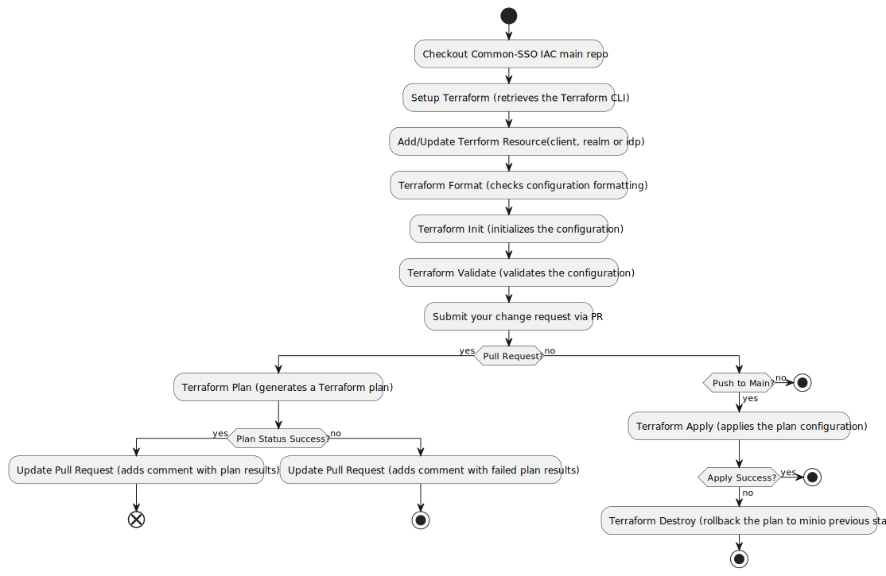

# AG PSSG Common SSO Realm and Client Configuration

This repository holds the keycloak realms and client configuration files for the Ministry of Attorney General and Public Safety Redhat SSO instance. Developers can open pull requests to create or change their client or realm configuration.

## How to create or update a client configuration

1. Get permission from the DIAM Team to make pull requests to this repo.
2. Create a pull request with your proposed changes to client configuration file. Make sure your changes are [properly formatted](#terraform-format).
3. An automatic process will compare your changes to the current state of Red hat SSO.
4. A bot will add a comparison report to your pull request.
5. An Access Management Team member will merge your changes into the `main` branch.
6. An automatic process will apply your changes to the Common SSO Red hat instance.

## Automation

A GitHub Actions workflow is used to apply the configurations to the Keycloak instance using Terraform.

### Overview

⚠ GitHub Actions uses a local Terraform executable, not Terraform Cloud. This diagram has not been updated.


The workflow will:

1. check whether the configuration is formatted properly to demonstrate how you can enforce best practices
2. generate a plan for every pull request
3. apply the configuration when you update the main branch

### Detailed description


1. **Checkout** check outs the current configuration. Uses defines the action/Docker image to run that specific step. The checkout step "uses" GitHub's actions/checkout@v2 action.
1. **Setup Terraform** retrieves the Terraform CLI used in the GitHub action workflow.
1. **Terraform Format** checks whether the configuration has been properly formatted. If the configuration isn't [properly formatted](#terraform-format) this step will produce an error. It enforces Terraform best practices by preventing your team from merging unformatted configuration to `main`. In case of formatting errors, detailed explanation is displayed (`steps.fmt.outputs.stdout`). This allows your team to review the formatting changes that need to be done directly in the PR instead of viewing the GitHub Actions log. 
1. **Terraform Init** initializes the configuration used in the GitHub action workflow.
1. **Terraform Validate** validates the configuration used in the GitHub action workflow.
1. **Terraform Plan** generates a Terraform plan. Notice:
    * This step only runs on pull requests. The PR generates a plan. When the PR is merged, that plan will be applied.
    * This step will continue even when it errors. This allows the next step to display the plan error message even if
      this step fails.
1. **Update Pull Request** adds a comment to the pull request with the results of the format, init and plan steps. In addition, it displays the plan output (`steps.plan.outputs.stdout`). This allows your team to review the results of the plan directly in the PR instead of viewing the GitHub Actions log. This step only runs on pull requests.
1. **Terraform Plan Status** returns whether a plan was successfully generated or not. This step highlights whenever a plan fails because the "Terraform Plan" step continues on error.
1. **Terraform Apply** applies the configuration. This step will only run when a commit is pushed to main.
1. **Terraform Destroy** If there's an error applying your terrform plan, a rollback will be triggered to destroy any plan that was created initially. This allow us to rollback our red hat sso to its previous state before running your plan


<details>

```
@startuml commonsso
!define STEP_BG_COLOR #B0C4DE
!define DECISION_COLOR #90EE90
!define STOP_COLOR #FF6347

skinparam rectangle {
  BackgroundColor STEP_BG_COLOR
  BorderColor #000000
  BorderThickness 2
}

skinparam decision {
  BackgroundColor DECISION_COLOR
  BorderColor #000000
}

skinparam stop {
  BackgroundColor STOP_COLOR
  BorderColor #000000
}

|Workflow|
start
:Checkout Common-SSO IAC main repo;
:Setup Terraform (retrieves the Terraform CLI);
:Add/Update Terrform Resource(client, realm or idp);
:Terraform Format (checks configuration formatting);
:Terraform Init (initializes the configuration);
:Terraform Validate (validates the configuration);
:Submit your change request via PR;
if (Pull Request?) then (yes)
  :Terraform Plan (generates a Terraform plan);
  if (Plan Status Success?) then (yes)
    :Update Pull Request (adds comment with plan results);
end
  else (no)
    :Update Pull Request (adds comment with failed plan results);
    stop
  endif
else (no)
  if (Push to Main?) then (yes)
    :Terraform Apply (applies the plan configuration);
    if (Apply Success?) then (yes)
      stop
    else (no)
      :Terraform Destroy (rollback the plan to minio previous state);
      stop
    endif
  else (no)
    stop
  endif
endif
@enduml
```

</details>

### Local set-up (Access Management team only)

In some rare cases you may need to set up Terraform locally. It is easy to do so. Note that this same
configuration is used by GitHub Actions, so may refer to its commands and secrets for comparison.

1. Install Terraform (use version identified in https://github.com/bcgov/ag-sso-terraform/blob/develop/.github/workflows/terraform.yml).
2. Set environment variables.
3. Checkout the project.
4. Run `terraform init -backend-config="access_key={MINIO_ACCESS_KEY_ID}" -backend-config="secret_key={{MINIO_SECRET_KEY}}"`.

Once the above steps are complete, you will be able to run all Terraform commands.

#### Terraform format

This repository enforces having all configuration formatted in the same manner. 
To ensure proper formatting run `terraform fmt -recursive` from the root of moh-keycloak-client-configurations.
Terraform will modify the files, so they satisfy the formatting constraints.
Environment variables set-up is not necessary to run this command, it can be performed by anyone who has Terraform installed.
In case of being unable to install Terraform, formtting issues need to be resolved manually. 


#### Environment variables

Terraform uses these secrets to access its state file stored on AWS.

* `AWS_ACCESS_KEY_ID`
* `AWS_SECRET_ACCESS_KEY`
* `AWS_S3_BACKEND_ROLE_ARN`
* `TF_VAR_dev_client_secret`
* `TF_VAR_test_client_secret`
* `TF_VAR_prod_client_secret`
* `TF_VAR_CLIENT_AUTH_PASS` # this is the client credential secret for keycloak client with custom claim to JUSTIN

The values for the `TF_VAR_ENV_client_secret` environment variables are Keycloak client secrets. To retrieve them, login to the development, test, and production Keycloak Admin Console and lookup their values at `ISB (realm) > terraform (client) > Credentials (tab)`.

## References

* [Terraform Backend Configuration](https://www.terraform.io/language/settings/backends/configuration)
* [Terraform S3 backend](https://www.terraform.io/language/settings/backends/s3)
* [Terraform Keycloak Provider](https://registry.terraform.io/providers/mrparkers/keycloak/latest/docs)

## Terraform State File using Minio S3 Compatible Storage

The Terraform state file containing our Red hat Keycloak configuration is stored in an S3 compatible storgae (Minio) hosted internally in our Gold Cluster. In order for this to work, Terraform requires a service account with the necessary permissions to access the bucket. To fulfill this requirement, an acess key and secret was created in Minio with the necessily permission to read and write TF state files into our bucket


## Acknowledgements

This README uses some text verbatim and diagrams
from [Terraform's documentation](https://learn.hashicorp.com/tutorials/terraform/github-actions).
[Terraform Keycloak Provide](https://registry.terraform.io/providers/mrparkers/keycloak/latest/docs)
[Terraform OIDC Client](https://registry.terraform.io/providers/mrparkers/keycloak/latest/docs/resources/openid_client)
